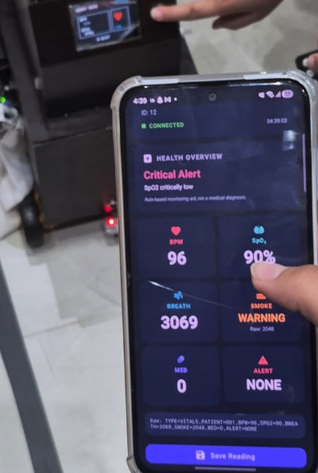
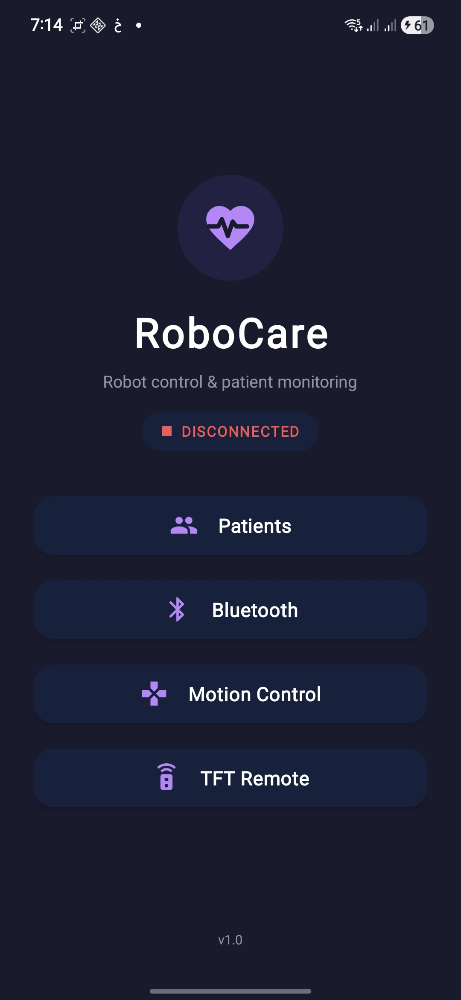
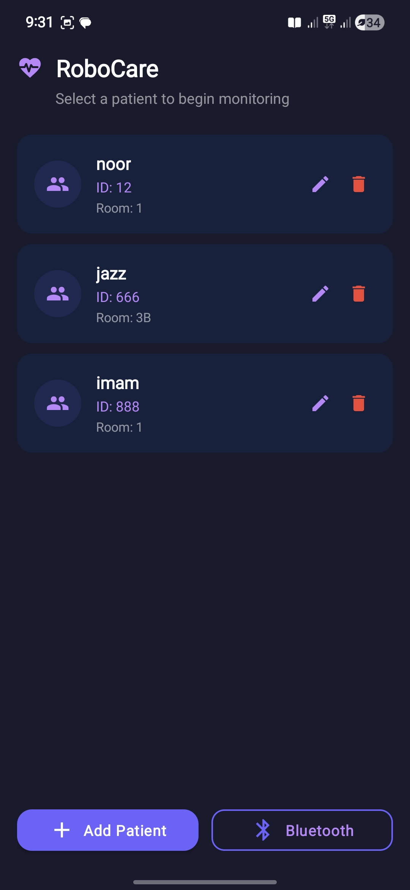
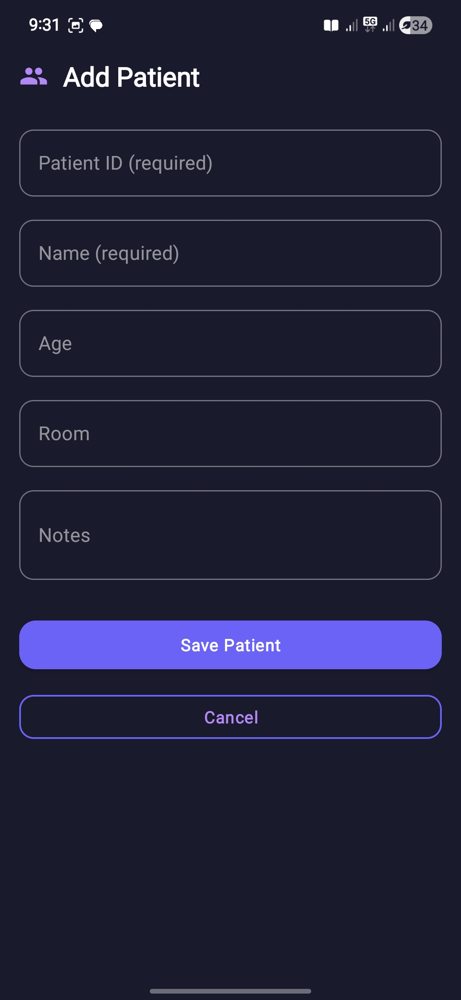
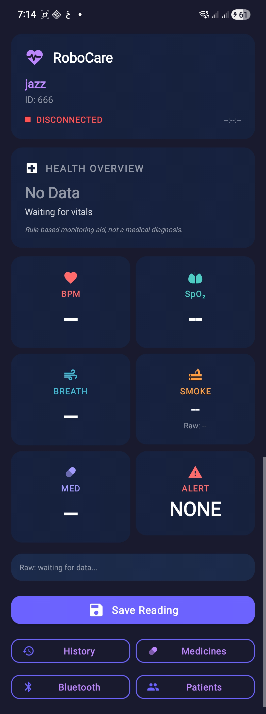
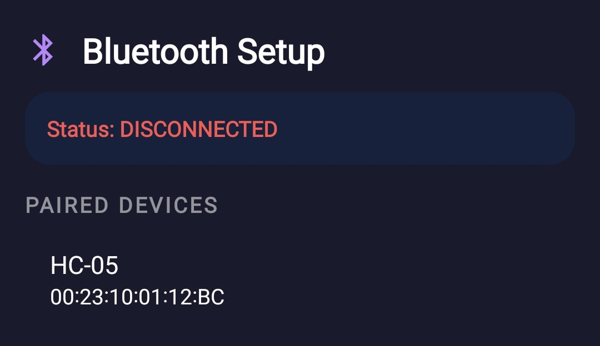
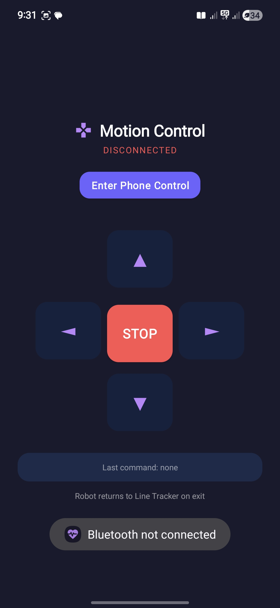
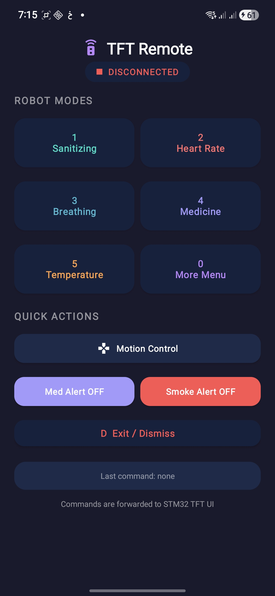
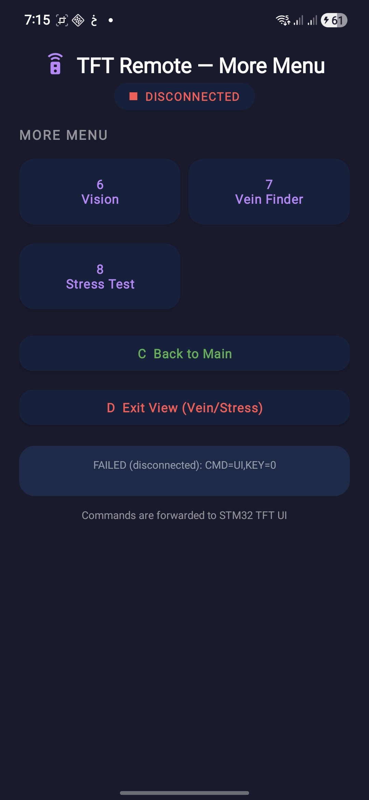
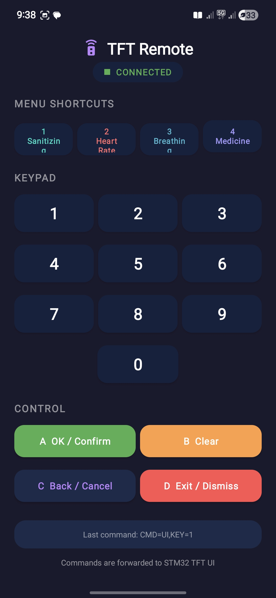

# RoboCare Monitor

Android companion app for a robotic patient-monitoring system built around an STM32 controller, an HC-05 Bluetooth Classic module, and Firebase Realtime Database.


RoboCare Monitor receives live vitals from a healthcare robot over Bluetooth, stores patient data in Firebase, and gives caregivers a single mobile interface for monitoring, alerts, patient records, medicine tracking, robot motion control, and TFT display control.

<p align="center">
  
</p>

## Features

### Live patient dashboard

- Displays heart rate, SpO2, respiration, smoke level, medicine timer, alert state, and raw packets.
- Classifies incoming readings as `Stable`, `Needs Attention`, or `Critical Alert`.
- Saves the latest reading automatically and allows manual history saves.

### Patient and medicine management

- Add, edit, delete, and select patient records.
- Assign medicines to individual patients.
- Mark medicines as active or inactive.
- Show active prescriptions when the robot raises a medicine alert.

### Bluetooth monitoring

- Uses Bluetooth Classic SPP with an HC-05 module.
- Keeps one shared Bluetooth connection alive through a singleton `BluetoothManager`.
- Reads newline-terminated packets continuously on a background thread.
- Posts connection and packet events back to the Android UI thread.

### Alerts

- Smoke values are shown as `SAFE`, `WARNING`, or `DANGER`.
- Medicine alerts show active prescriptions for the selected patient.
- Smoke and medicine alerts can be dismissed from the app, sending a command back to the robot.

### Robot controls

- Motion control screen with forward, backward, left, right, and stop commands.
- Phone-control handshake before movement commands are enabled.
- Safe exit sends stop and returns the robot to line-tracking mode.

### TFT remote

- Send-only remote for the robot's onboard TFT UI.
- Main mode buttons for sanitizing, heart-rate, breathing, medicine, temperature, and more.
- Medicine keypad, vision D-pad, and extended menu controls.
- Quick actions for motion control, smoke alert dismissal, and medicine alert dismissal.

## Screenshots

### Core app flow

| Home | Patients | Add Patient |
| --- | --- | --- |
|  |  |  |

### Monitoring and Bluetooth

| Full Dashboard | Bluetooth Setup |
| --- | --- |
|  |  |

### Robot control

| Motion Control | TFT Remote | More Menu |
| --- | --- | --- |
|  |  |  |

| TFT Keypad |
| --- |
|  |


## Tech Stack

| Area | Technology |
| --- | --- |
| Language | Java 8 |
| Platform | Android |
| Min SDK | 24 |
| Target SDK | 34 |
| UI | AppCompat, ConstraintLayout, Material Components |
| Backend | Firebase Realtime Database |
| Bluetooth | Bluetooth Classic SPP, HC-05 |
| Build | Gradle 8.13, Android Gradle Plugin 8.13.2 |

## Project Structure

```text
app/src/main/java/com/robot/patientmonitor/
|-- activities/
|   |-- MainActivity.java
|   |-- PatientListActivity.java
|   |-- AddPatientActivity.java
|   |-- DashboardActivity.java
|   |-- HistoryActivity.java
|   |-- MedicinesActivity.java
|   |-- BluetoothConnectActivity.java
|   |-- MotionControlActivity.java
|   `-- TftRemoteActivity.java
|-- bluetooth/
|   `-- BluetoothManager.java
|-- data/
|   |-- AppState.java
|   `-- FirebaseRepository.java
|-- models/
|   |-- Patient.java
|   |-- Reading.java
|   `-- Medicine.java
`-- parser/
    `-- PacketParser.java
```

## Getting Started

### Prerequisites

- Android Studio.
- Android phone or tablet running Android 7.0 or newer.
- Bluetooth Classic support on the Android device.
- Paired HC-05 Bluetooth module.
- Firebase project with Realtime Database enabled.

### Setup

1. Clone the repository.

   ```bash
   git clone https://github.com/Jasminex6/RoboCare-App.git
   cd RoboCare-App
   ```

2. Add Firebase configuration.

   Download `google-services.json` from the Firebase Console and place it at:

   ```text
   app/google-services.json
   ```

   The repository includes `app/google-services.json.example` as a template reference.

3. Open the project in Android Studio.

   Select the project root, let Gradle sync, and confirm that the Android Gradle plugin downloads successfully.

4. Pair the HC-05 module.

   Pair the Android device with the robot's HC-05 module from system Bluetooth settings. Common default PINs are `1234` or `0000`.

5. Build and run.

   Use Android Studio's Run button, or run:

   ```bash
   ./gradlew installDebug
   ```

   On Windows:

   ```powershell
   .\gradlew.bat installDebug
   ```

## App Flow

```text
MainActivity
|-- Patients
|   |-- Add or edit patient
|   |-- Delete patient
|   `-- Select patient
|       |-- Live dashboard
|       |-- Medicines
|       |-- Reading history
|       `-- Bluetooth setup
|-- Bluetooth setup
|-- Motion control
`-- TFT remote
```

## Serial Protocol

The STM32 sends newline-terminated key-value packets through the HC-05 connection.

Example:

```text
TYPE=VITALS,PATIENT=001,BPM=82,SPO2=97,BREATH=540,SMOKE=120,MED=300,ALERT=NONE
```

| Field | Type | Description |
| --- | --- | --- |
| `TYPE` | String | Packet type. The app processes `VITALS`. |
| `PATIENT` | String | Patient ID. Falls back to the selected patient if missing. |
| `BPM` | Integer | Heart rate in beats per minute. |
| `SPO2` | Integer | Blood oxygen saturation percentage. |
| `BREATH` | Integer | Respiration sensor value. |
| `SMOKE` | Integer | Smoke sensor ADC value. |
| `MED` | Integer | Medicine timer in seconds. Values outside 0-600 are treated as 0. |
| `ALERT` | String | Alert state such as `NONE`, `MED`, `SMOKE`, or `FIRE`. |

Malformed or unsupported packets are ignored instead of crashing the app.

## App-to-Robot Commands

### Motion

| Command | Purpose |
| --- | --- |
| `CMD=MOTION,MODE=PHONE` | Enter phone-control mode. |
| `CMD=MOTION,MODE=LINE` | Return to line-tracking mode. |
| `CMD=MOTION,DIR=FWD` | Move forward. |
| `CMD=MOTION,DIR=BACK` | Move backward. |
| `CMD=MOTION,DIR=LEFT` | Turn left. |
| `CMD=MOTION,DIR=RIGHT` | Turn right. |
| `CMD=MOTION,DIR=STOP` | Stop movement. |

### Alerts

| Command | Purpose |
| --- | --- |
| `CMD=MED,ALERT=OFF` | Dismiss medicine alert. |
| `CMD=SMOKE,ALERT=OFF` | Dismiss smoke alert. |

### TFT UI

| Command | Purpose |
| --- | --- |
| `CMD=UI,KEY=1` to `CMD=UI,KEY=8` | Select TFT menu options. |
| `CMD=UI,KEY=0` | Open or return through the extended TFT menu flow. |
| `CMD=UI,KEY=A` | Confirm or select. |
| `CMD=UI,KEY=B` | Clear input. |
| `CMD=UI,KEY=C` | Back. |
| `CMD=UI,KEY=D` | Exit current view. |
| `CMD=UI,KEY=CAM_UP` | Vision control: up. |
| `CMD=UI,KEY=CAM_DOWN` | Vision control: down. |
| `CMD=UI,KEY=CAM_LEFT` | Vision control: left. |
| `CMD=UI,KEY=CAM_RIGHT` | Vision control: right. |

Commands are sent with a trailing newline by the Android app.

## Health Thresholds

| Condition | App status |
| --- | --- |
| Active alert is not `NONE` | Critical Alert |
| SpO2 below 92 | Critical Alert |
| Smoke value 3000 or higher | Critical Alert |
| SpO2 below 95 | Needs Attention |
| Smoke value from 2000 to 2999 | Needs Attention |
| BPM below 55 or above 110 | Needs Attention |
| Otherwise | Stable |

## Firebase Data Model

```text
robocare/
`-- patients/
    `-- {patientId}/
        |-- patientId
        |-- name
        |-- age
        |-- room
        |-- notes
        |-- createdAt
        |-- latest/
        |   |-- bpm
        |   |-- spo2
        |   |-- breath
        |   |-- smoke
        |   |-- med
        |   |-- alert
        |   `-- timestamp
        |-- readings/
        |   `-- {readingId}/
        `-- medicines/
            `-- {medicineId}/
                |-- name
                |-- dose
                |-- notes
                |-- active
                `-- createdAt
```

## Permissions

The app requests:

- `INTERNET` for Firebase.
- `BLUETOOTH_CONNECT` for Android 12 and newer.
- `BLUETOOTH`, `BLUETOOTH_ADMIN`, and `ACCESS_FINE_LOCATION` for Android 11 and older Bluetooth discovery/connection behavior.

## Notes

- `google-services.json` is intentionally not committed. Use your own Firebase project configuration.
- The app is designed for physical-device testing because emulator Bluetooth support is limited.
- The current serial protocol expects newline-terminated packets.

## License

This project is licensed under the MIT License. See [LICENSE](LICENSE) for details.

Copyright (c) 2026 Yasmine Ismail Hamed
